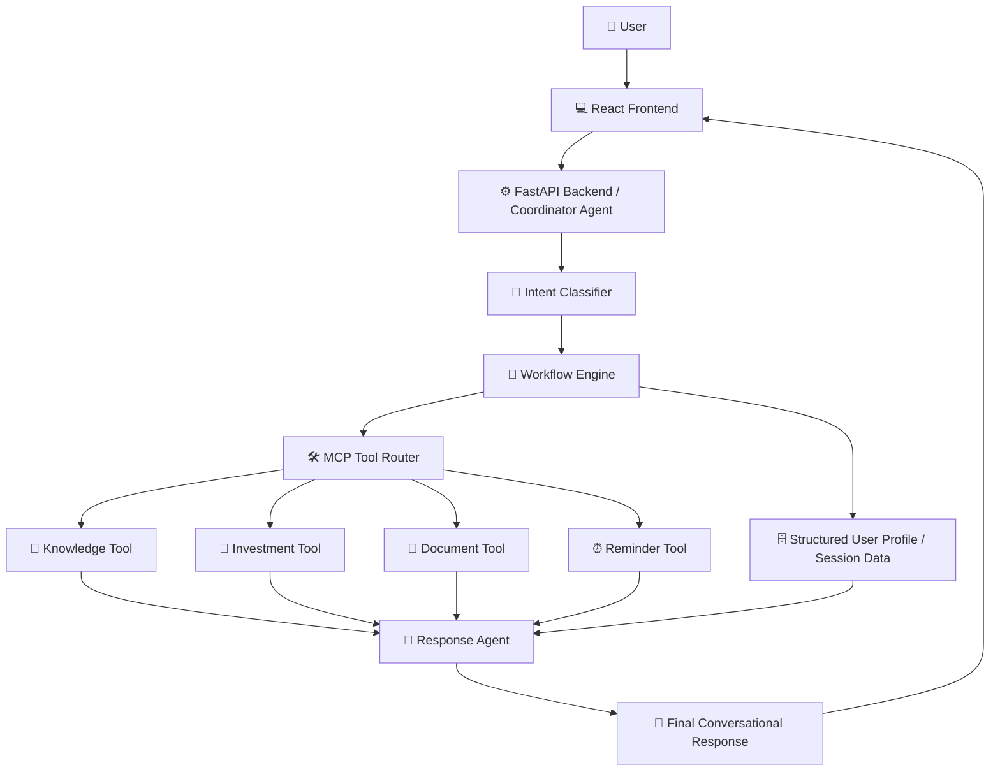

<h1 align="center">🚀 AGEX</h1>
<h3 align="center">Multi-Agent GenAI Tax Planning Assistant</h3>

<p align="center">
  An AI system that coordinates agents, tools, and structured data to complete real-world tax planning workflows.
</p>

<p align="center">
  
  
  
  
  
  
</p>

---

## ✨ What is AGEX?

**AGEX** is a **multi-agent AI tax planning assistant** built for a hackathon challenge focused on agent coordination, tool integration, structured data, and API-based workflows.

Instead of behaving like a simple chatbot, AGEX works like a **workflow-driven GenAI assistant** that can:

- understand user intent
- collect missing profile details step by step
- route requests to the right tools
- explain tax concepts
- suggest tax-saving options
- generate document checklists
- create reminders
- maintain structured user profile data during the conversation

---

## 🏆 Hackathon Problem Statement Alignment

**Problem Statement:**  
Build a multi-agent AI system that helps users manage tasks, schedules, and information by interacting with multiple tools and data sources.

### ✅ How AGEX aligns

| Hackathon Requirement | AGEX Implementation |
|---|---|
| Primary agent coordinating sub-agents | Coordinator Agent |
| Structured data storage and retrieval | User profile + session state |
| Multiple tools via MCP-style integration | Knowledge, Investment, Document, Reminder tools |
| Multi-step workflows | Tax planning workflow |
| API-based deployment | FastAPI endpoints |
| Real-world workflow completion | Tax planning and compliance preparation |

---

## 🧠 Why AGEX is a GenAI System

AGEX is designed as a **GenAI workflow assistant**, not just a response bot.

### It combines:
- 🤖 **LLM-powered response generation**
- 🧩 **agent orchestration**
- 🛠️ **tool calling**
- 🗄️ **structured profile state**
- 🔄 **multi-step workflow handling**
- 💬 **conversational UX**
- 📡 **API-first backend architecture**

---

## 🏗️ System Architecture



## 🤖 Multi-Agent Design

AGEX follows a **Coordinator + Sub-Agent + Tools** architecture where a primary coordinator agent manages conversation flow and routes tasks to specialized agents and tools.

| Agent / Module | Role |
|----------------|------|
| 🎯 Coordinator Agent | Controls conversation flow and routes tasks |
| 🧠 Intent Agent | Detects user intent |
| 🔄 Workflow Agent | Handles tax planning workflow |
| 📘 Knowledge Tool | Explains tax concepts |
| 💸 Investment Tool | Suggests tax-saving options |
| 📂 Document Tool | Generates document checklists |
| ⏰ Reminder Tool | Creates reminders |
| 🗣️ Response Agent | Converts outputs into natural conversational responses |

## 🔄 Multi-Step Workflow

AGEX completes tasks through a **multi-step conversational workflow** where the system collects structured information step-by-step before providing recommendations.

### Workflow Example

User → Wants to save tax  
→ System asks income type  
→ System asks rent status  
→ System asks investments  
→ Builds user tax profile  
→ Suggests investments  
→ Provides document checklist  
→ Sets reminder  
→ Explains tax concepts  

This demonstrates **workflow execution and agent coordination**.

## 🛠️ Tools Integrated

AGEX integrates multiple tools to complete tasks instead of just answering questions.

| MCP Tool | Purpose |
|------|---------|
| 📘 Knowledge Tool | Explains tax concepts like HRA, PPF, GST, PF |
| 💸 Investment Tool | Suggests tax-saving investment options |
| 📂 Document Tool | Generates required tax document checklist |
| ⏰ Reminder Tool | Helps schedule tax reminders |
| 🗄️ Profile Store | Stores user persona and workflow state |

## 📊 Structured Data Captured

AGEX maintains structured user information which is used across workflows and tools.

The system stores:

- 👤 User type (salaried / business)
- 🏠 Rent status
- 💰 Tax-saving investment status
- 🧾 GST concern
- ⏰ Reminder information
- 💬 Session conversation state

This structured data allows the system to make **personalized workflow decisions**.

## 💬 Example Conversation

User: I want to save tax  
AGEX: I can help with that. To guide you properly, I first need to understand your income type a little better. Are you salaried or self-employed?

User: salaried  
AGEX: Rent can affect the deductions available to you, so I just want to confirm one thing. Do you currently pay rent?

User: yes  
AGEX: Tax-saving investments can make a real difference to your final tax outgo, so I want to check this as well. Have you invested in options like PPF, ELSS, NPS, or insurance?

User: no  
AGEX: Based on what you’ve shared, I can now help you explore tax-saving investment options, document requirements, and reminders.


## ▶️ Run Locally

### Backend
```bash
pip install -r requirements.txt
uvicorn main:app --host 0.0.0.0 --port 8080

Frontend:
cd frontend
npm install
npm run dev

## 🚀 Future Scope

Future improvements for AGEX:

- 📥 Save chat history
- 🔐 User authentication
- 🧾 Tax calculator
- 📄 Document upload support
- 📊 Dashboard view
- 🧠 RAG over tax law content
- 🏢 GST workflows for business users
- 📱 WhatsApp / Telegram integration
- 🎙️ Voice interaction

## 👩‍💻 Author

**Mohit Kushwaha**

GitHub Repository:  
https://github.com/Mk-devil-24/agex-ai-tax-assistant

## 📜 License

This project is for educational, portfolio, and hackathon demonstration purposes.
